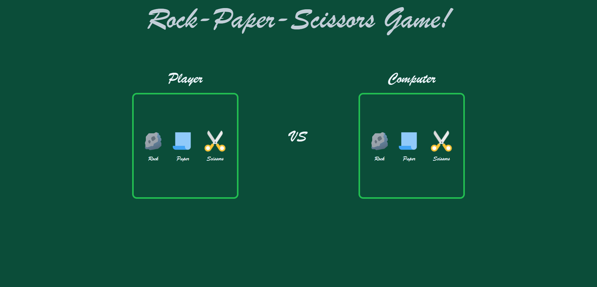

# Rock-Paper-Scissors

Live Demo:
https://leo-tsant.github.io/Rock-Paper-Scissors/

## Overview

This project was created for the [Rock-Paper-Scissors assignment](https://www.theodinproject.com/lessons/foundations-rock-paper-scissors) as part of [The Odin Project](https://www.theodinproject.com/). A simple web-based game that allows users to play the classic Rock Paper Scissors game against the computer. Built using HTML, CSS, and JavaScript, this project demonstrates basic JavaScript logic and DOM manipulation.
